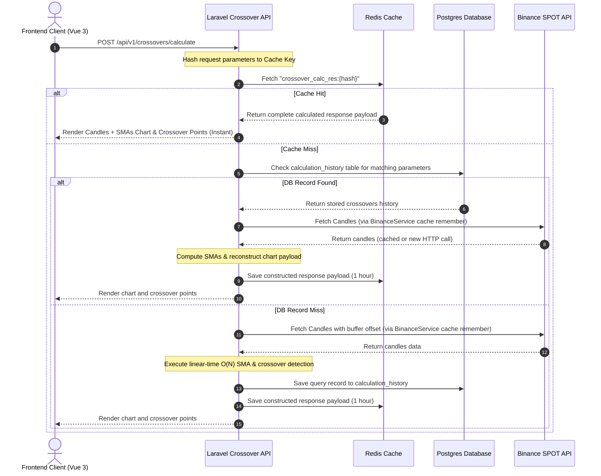

# Crypto Crossover Analyzer SPA (Clean Hexagonal Laravel-Vue)

A modern, high-performance monorepo application implementing Clean Hexagonal Architecture (Ports and Adapters) using **Laravel** (PHP 8) and **Vue.js 3** (Vite SPA) to calculate and detect Simple Moving Average (SMA) crossovers using Binance Spot market data.

---

## 🎬 Live Demo

https://github.com/SergioZona/crypto-sma-crossover-laravel-vue/raw/main/docs/FRONTEND_DEMO.mp4

> **Note:** The video above shows the SPA in action — entering credentials, selecting a symbol/interval/date range and SMA periods, loading the candlestick chart with SMA overlays, and inspecting detected crossover points.

---

## Directory Structure

```
├── backend/            # Backend structured in Clean Hexagonal Architecture
│   ├── app/
│   │   ├── Domain/     # Abstractions (Candle, Crossover) & Pure Math Service (CrossoverCalculator)
│   │   ├── Application/# Ports Interfaces & Orchestrating UseCases
│   │   └── Infrastructure/ # Outbound adapters (Postgres, Redis cache, Binance API) & controllers
│   └── tests/Unit/     # Unit tests verifying domain crossover logic
│
├── frontend/           # Standalone Frontend Vite Vue 3 SPA (TypeScript)
│   └── src/
│       ├── components/ # Common UI components (Header, PasswordGuard)
│       ├── features/
│       │   └── crossover/ # Encapsulated domain components & composables
│       ├── locales/    # decoupled JSON dictionary files (es.json, en.json)
│       ├── App.vue     # Glassmorphic Crossover Dashboard orchestrator
│       └── i18n.ts     # Lightweight reactive translations configuration
│
└── docker/             # Docker compose orchestrator & container configs
    ├── .env            # Container local variables
    └── docker-compose.yml # PostgreSQL + Redis cache + Laravel API container environment
```

---

## System Integration Architecture

Below is the Mermaid sequence flowchart demonstrating the monorepo integration flow:



---

## Getting Started Locally

### 1. Build and Start the Docker Containers
Move to the `docker/` folder and boot up PostgreSQL, Redis, the Laravel backend, and the Vue frontend in the background:
```bash
cd docker
docker compose up -d
```

### 2. Execute Migrations
Create the database tables to persist crossover log histories:
```bash
docker compose exec backend php artisan migrate
```

### 3. Verification
- **API Health Check**: Query `http://localhost:8000/health` inside your browser to verify connectivity.
- **Frontend URL**: Access `http://localhost:5173` to view the interactive SPA dashboard.
- **Credentials**: Use the security key defined in `docker/.env` (`secret123`) to unlock query actions.

---

## SonarQube Quality Analysis

The repository is configured for SonarQube code quality analysis.
- Configuration properties: [sonar-project.properties](file:///c:/Users/Sergio%20Julian%20Zona%20M/Desktop/Repositorios/Proyectos%20externos/crypto-sma-crossover-laravel-vue/sonar-project.properties)
- CI Automation Workflow: `.github/workflows/build.yml`
