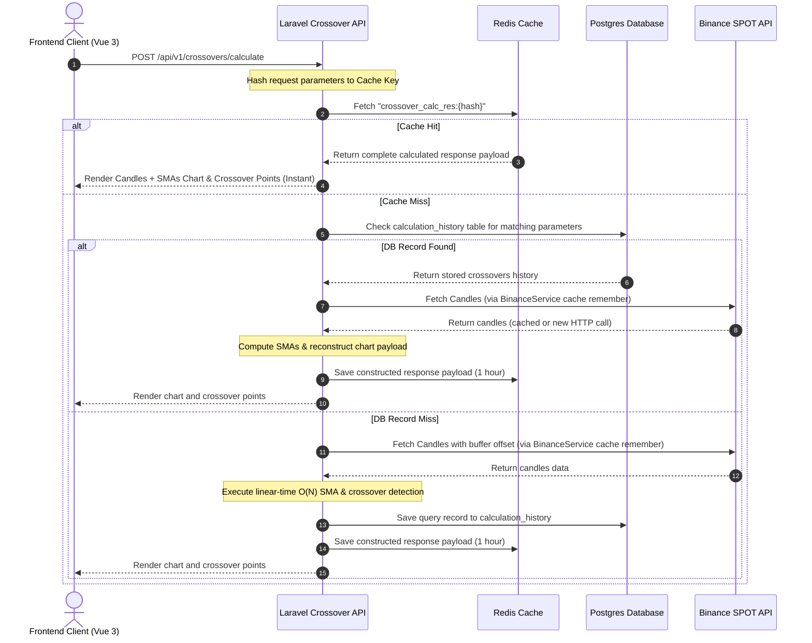

# Crypto Crossover Analyzer SPA (Laravel & Vue 3 Monorepo)

A modern, high-performance monorepo application implementing standard **Laravel 11** directory structures and a clean **Vue.js 3 (Vite + TypeScript)** SPA layout to calculate and detect Simple Moving Average (SMA) crossovers using Binance Spot market data.

---

## 🎬 Live Demo

https://github.com/SergioZona/crypto-sma-crossover-laravel-vue/raw/main/docs/FRONTEND_DEMO.mp4

> **Note:** The video above shows the SPA in action — entering credentials, selecting a symbol/interval/date range and SMA periods, loading the candlestick chart with SMA overlays, and inspecting detected crossover points.

---

## Architecture Conventions

### 🐘 Laravel Backend
The backend strictly adheres to standard Laravel framework conventions as defined in the [Laravel Directory Structure Documentation](https://laravel.com/docs/13.x/structure).

- **Controllers**: Coordinate requests, validations, and JSON responses.
- **Models**: Standard Eloquent structures for database interactions.
- **Services**: Dedicated business services (`BinanceService` for HTTP integrations, `CrossoverCalculator` for crossover math logic).

### ⚡ Vue Frontend
The frontend follows clean, industry-grade Vue 3 best practices, utilizing the **Composition API** (`<script setup lang="ts">`) and a modular **Feature-Based Architecture**:

- **Features**: Highly encapsulated sub-directories representing domain boundaries (e.g. `src/features/crossover/`).
- **Composables**: Extracted state, calculations, and API orchestration into reusable hooks (`useCrossover.ts`).
- **Translations**: Dynamic locales externalized as JSON files for dynamic i18n support.

---

## Directory Structure

```
├── backend/            # Standard Laravel 11 structure (Eloquent + Services)
│   ├── app/
│   │   ├── Http/Controllers/ # Endpoint handlers (CrossoverApiController)
│   │   ├── Models/     # Eloquent models (CalculationHistory, Candle, Crossover)
│   │   ├── Services/   # Binance integrations & linear-time O(N) crossover logic
│   │   └── Exceptions/ # Dedicated domain exceptions (BinanceApiException)
│   └── tests/Unit/     # Unit tests verifying crossover math calculation
│
├── frontend/           # Standalone Frontend Vite Vue 3 SPA (TypeScript)
│   └── src/
│       ├── components/ # Common UI components (Header, PasswordGuard)
│       ├── features/
│       │   └── crossover/ # Encapsulated domain feature components & composables
│       ├── locales/    # externalized English/Spanish translation dictionaries
│       ├── App.vue     # Glassmorphic main SPA dashboard coordinator
│       └── i18n.ts     # Lightweight reactive translations configuration
│
└── docker/             # Docker compose orchestrator & container configs
    ├── .env            # Container local variables
    └── docker-compose.yml # PostgreSQL + Redis + Laravel server container environment
```


---

## System Integration Architecture

Below is the Mermaid sequence flowchart demonstrating the monorepo integration flow:



---

## Getting Started Locally

### 1. Build and Start the Docker Containers
Move to the `docker/` folder and boot up PostgreSQL, Redis, the Laravel backend, and the Vue frontend in the background:
```bash
cd docker
docker compose up -d
```

### 2. Execute Migrations
Create the database tables to persist crossover log histories:
```bash
docker compose exec backend php artisan migrate
```

### 3. Verification
- **API Health Check**: Query `http://localhost:8000/health` inside your browser to verify connectivity.
- **Frontend URL**: Access `http://localhost:5173` to view the interactive SPA dashboard.
- **Credentials**: Use the security key defined in `docker/.env` to unlock query actions.

---

## SonarQube Quality Analysis

The repository is configured for SonarQube code quality analysis.
- Configuration properties: [sonar-project.properties](file:///c:/Users/Sergio%20Julian%20Zona%20M/Desktop/Repositorios/Proyectos%20externos/crypto-sma-crossover-laravel-vue/sonar-project.properties)
- CI Automation Workflow: `.github/workflows/build.yml`
